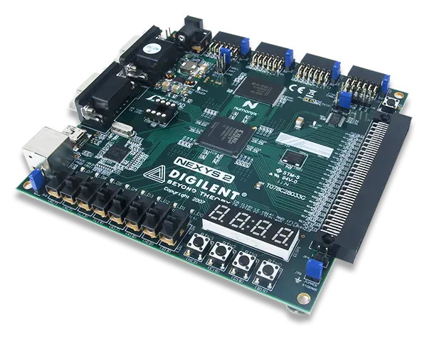

# FPGA Timer

At the **Large Scale Integrated Circuits** laboratory meetings, we learned to program an FPGA
board by writing **Verilog** code. The trainer board was a [Digilent Nexys 2](https://digilent.com/reference/programmable-logic/nexys-2/start).

After uploading the generated programming file, the board will start the counter and display the seconds passed:
- in binary with the 8 LEDs
- in hexadecimal on the 4-digit seven-segment display

The user has 3 controls available:
1. Start - first switch (R17)
2. Stop - second switch (N17)
3. Pause - third switch (L13)

To send a control signal - toggle the switch on and back off. (use
them as push buttons)

